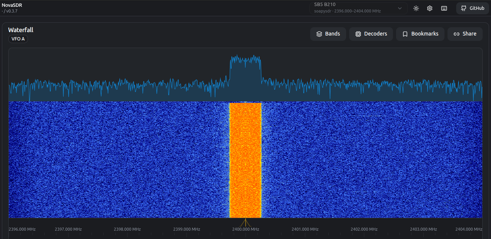
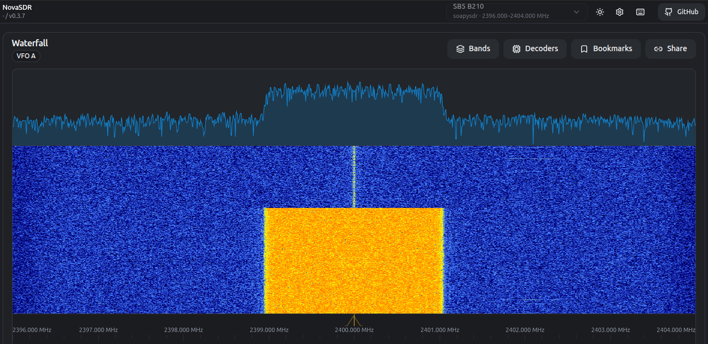
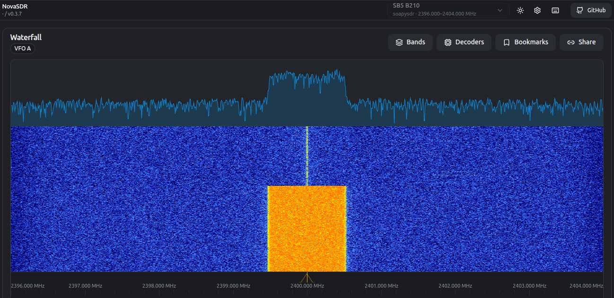

# Nyquist formula: relating data rate and bandwidth 

This experiment looks at the relationship between data transmission rate, bandwidth, and modulation scheme, as described by the Nyquist formula.

It should take about 60-120 minutes to run this experiment, but you will need to have reserved that time in advance. This experiment uses wireless resources - either the sb5 sandbox at [COSMOS](http://cosmos-lab.org), or the sb7 sandbox at [COSMOS](http://cosmos-lab.org) - and you can only use wireless resources during a reservation.

To run this experiment, you will need a COSMOS account, and you will need to have joined a project. You should have already uploaded your SSH keys to your profile. (If you haven't used COSMOS before, you may want to first go through [Hello, COSMOS](https://ffund.github.io/hello-opencode/).) Finally, you must have reserved time on the sandbox, and you must run this experiment during your reserved time. 

- Skip to [Results](#results)
- Skip to [Run my experiment](#run-my-experiment)

## Background

The Nyquist formula gives the upper bound for the data rate of a transmission system by calculating the bit rate directly from the number of signal levels and the bandwidth of the system.

Specifically, in a noise-free channel, Nyquist tells us that we can transmit data at a rate of up to

$$ C = 2B\\;log\_2\\;M$$

bits per second, where *B* is the bandwidth (in Hz) and *M* is the number of signal levels.

Nyquist is only an upper bound, and on the baseband signal bandwidth - the occupied transmission bandwidth for a wireless signal will further depend on how the signal is modulated onto a carrier frequency for wireless transmission. In this experiment, we will use [PSK modulation](https://en.wikipedia.org/wiki/Phase-shift_keying), a digital modulation scheme in which the phase of a carrier signal is varied to represent different bits, or different groups of bits, and there are a discrete number of signal "levels" represented by different phase shifts.

In our experiment, the modulated wireless signal at RF will occupy a transmission bandwidth that is **double** the Nyquist bandwidth (at baseband):


**Image: Original bitmap version by Splash, SVG version by Qef.** [**CC-BY-SA-3.0**](https://creativecommons.org/licenses/by-sa/3.0/)**, via** [**Wikimedia Commons**](https://commons.wikimedia.org/wiki/File:Baseband_to_RF.svg)

(the transmissions here have a 5% roll-off so you can expect a few percent more than this.)

The basic relationships implied by Nyquist will still hold:

- Doubling the data rate (*C*) and keeping the number of signal levels (*M*) the same, will double the bandwidth used (*B*), and
- Squaring the number of signal levels (*M*) and keeping the data rate (*C*) the same, will halve the bandwidth used (*B*).

In this experiment, we will send a constant amount of data over a wireless channel, with varying data rates (*C*) and number of signal levels (*M*). We will observe the effect of these variations on two metrics:

1. The total time required to transfer the data, and
2. The transmission bandwidth.

We expect to see that there are two ways to increase the speed of data transmission: using more bandwidth, or using more signal levels.

## Results

When we send 5 megabytes (40 Mbits) of data at a rate of 0.5 Mbps, using BPSK (2 signal levels), we see that about 0.5 MHz of bandwidth is used, and the total transmission takes a little over 80 seconds:



If we change the bitrate to 2 Mbps, 2 MHz of bandwidth is used and the transmission takes about 20 seconds. To reduce the speed of data transfer by a factor of 4, we had to increase the bandwidth by a factor of 4:



Finally, on changing the constellation size to 4 points (squaring the number of signal levels relative to the first transmission), the transmission also takes about 20 seconds, but uses only half the bandwidth, 1 MHz, when transmitting at 2 Mbps:



## Run my experiment

To run this experiment, you need a reservation on a sandbox at COSMOS. You will have to make your reservation in advance. This experiment uses the 2.4 GHz ISM band at the documented cabled configuration; it is not authorization for other bands or an antenna experiment. It works on either the sb5 sandbox (USB USRP B210) or the sb7 sandbox (Ethernet USRP N210 with SBX daughterboards); the instructions below give both where they differ.

### Set up testbed

At your reserved time, open a terminal and log in to the console of the testbed that you have reserved:

If you are using sb5, run

```
ssh YOUR_USERNAME@sb5.cosmos-lab.org
```

If you are using sb7, run

```
ssh YOUR_USERNAME@sb7.cosmos-lab.org
```

Then, you must load a disk image onto the testbed nodes. From the testbed console, run:

```
omf tell offs -t node1-1,node1-2
omf load -i baseline-sdr.ndz -t node1-1,node1-2
```

This disk image has the [GNU Radio](http://gnuradio.org/) software suite, the USRP/UHD drivers, and the SoapySDR abstraction layer (including the SoapySDR UHD support module) pre-installed.

This process can take 5-10 minutes. Don't interrupt it in middle - you'll just have to start again, and it will only take longer.

If it's been successful, then once the process finishes running completely you should see output similar to:

```
 INFO exp:  -----------------------------
 INFO exp:  Imaging Process Done
 INFO exp:  2 nodes successfully imaged - Topology saved in '/tmp/omf-pxe_slice-XXXX-topo-success.rb'
 INFO exp:  -----------------------------
```

Sometimes, transient errors can cause the process to fail - if you haven't successfully imaged 2 nodes, wait a few minutes and try again.

Then, turn on your nodes with the following command:

```
omf tell on -t node1-1,node1-2
```

Wait a few minutes for your testbed nodes to turn on, then continue with the experiment.

#### If you are using sb7: connect the radios

The N210s are Ethernet devices on the 192.168.10.x subnet, attached to the `enp4s0` interface on each node. After imaging, assign the interface IP once on each node:

```
ip addr add 192.168.10.1/24 dev enp4s0
```

(If the address is already set, the command will report that it already exists, which is fine.) This assignment is not persistent across reboots, so re-apply it after every image load or reboot.

### Install NovaSDR (spectrum analyzer) on the receiver

NovaSDR is a web-based SDR receiver application (spectrum + waterfall in your browser). 

On the console, log in to the receiver node (we will use `node1-1` as the receiver):

```
ssh root@node1-1
```

On the receiver node, get the experiment repository (it contains the NovaSDR configuration files in `conf/`):

```
git clone https://github.com/teaching-on-testbeds/nyquist.git
```

Then install the system libraries that NovaSDR needs (SoapySDR, opus for compressed audio streams, and clFFT, which the prebuilt release links against):

```
apt-get update
apt-get install -y libsoapysdr0.8 soapysdr-tools libopus0 libclfft-dev
```

Download and unpack the NovaSDR release:

```
cd /root
curl -fsSL -o novasdr.tar.gz \
  https://github.com/phasor-labs/NovaSDR/releases/download/0.3.7/novasdr-0.3.7-linux-x86_64.tar.gz
tar xzf novasdr.tar.gz
cd /root/novasdr-0.3.7-linux-x86_64
```

Check that the radio is visible to SoapySDR:

```
SoapySDRUtil --find
```

If you are using sb5, you should see a line like `driver = uhd  label = B210 30D3F15` (in addition to the audio device). If you are using sb7, you should see a line like `driver = uhd  label = N210...` (if you only see the audio device, make sure you did the `ip addr add` step above). With the `baseline-sdr.ndz` image, the SoapySDR UHD module is already installed, so this step should work without any additional setup.

Copy the lab configuration into the NovaSDR directory and start the server:

If you are using sb5, run

```
cp /root/nyquist/conf/config.json /root/nyquist/conf/receivers.json /root/novasdr-0.3.7-linux-x86_64/config/
cd /root/novasdr-0.3.7-linux-x86_64
./novasdr-server -c config/config.json -r config/receivers.json
```

If you are using sb7, run

```
cp /root/nyquist/conf/config-n210.json /root/nyquist/conf/receivers-n210.json /root/novasdr-0.3.7-linux-x86_64/config/
cd /root/novasdr-0.3.7-linux-x86_64
./novasdr-server -c config/config.json -r config/receivers.json
```

Keep this terminal open, so that `novasdr` stays running.

The configuration is for a radio tuned to 2.4 GHz at 8 MS/s. This sample rate gives a ±4 MHz view of the spectrum, which is wide enough to see the occupied bandwidth of all the transmissions in this lab (up to about 2 MHz). The sb5 config uses a receive gain of 40 dB and the sb7 config uses 30 dB (the N210 SBX receive gain range is 0-31.5 dB).

### Prepare your browser

On your laptop, open a new terminal and set up an SSH tunnel from your laptop to the receiver node's NovaSDR port, going through the console:

If you are using sb5, run

```
ssh -L 9002:127.0.0.1:9002 -J YOUR_USERNAME@sb5.cosmos-lab.org root@node1-1
```

If you are using sb7, run

```
ssh -L 9002:127.0.0.1:9002 -J YOUR_USERNAME@sb7.cosmos-lab.org root@node1-1
```

Keep that terminal open. Then open your browser at:

```
http://localhost:9002/
```

You should see the NovaSDR waterfall (on "SB5 B210" on sb5, or "SB7 N210" on sb7), although there is no current transmission. You may adjust the min/max setting and colormap of the waterfall display to your preference.

### Prepare your transmitter

In a third terminal, log in to the node that will act as transmitter (we will use `node1-2`):

If you are using sb5, run

```
ssh -J YOUR_USERNAME@sb5.cosmos-lab.org root@node1-2
```

If you are using sb7, run

```
ssh -J YOUR_USERNAME@sb7.cosmos-lab.org root@node1-2
```

On the transmitter node, get the lab repository (it contains the transmitter, `src/narrowband_tx.py`):

```
git clone https://github.com/teaching-on-testbeds/nyquist.git
```

Then, to generate a PSK signal, run:

If you are using sb5, run

```
time python3 /root/nyquist/src/narrowband_tx.py -f 2400e6 -r 0.5e6 -M 5 -p 2 --excess-bw=0.05
```

If you are using sb7, run

```
time python3 /root/nyquist/src/narrowband_tx.py -f 2400e6 -r 0.5e6 -M 5 -p 2 \
  --excess-bw=0.05 --args addr=192.168.10.2 --subdev A:0 --tx-gain 20
```

where

- `-f` is used to set the frequency at which to transmit,
- `-r` specifies the bitrate at which to transmit, in bits per second,
- `-M` specifies the total amount of data to transmit, in megabytes,
- `-p` indicates how many constellation points (signal levels) to use (must be a power of 2),
- `--excess-bw` is a filter setting that determines how much "extra" leakage bandwidth the signal is allowed to use.

Later in this experiment, we will modify the values of the `-r` and `-p` arguments.

When we run this, we see that about 0.5 MHz of bandwidth is used, and the total transmission takes a little over 80 seconds (look at the "real" time in the final output on the transmitter):

```
TX BPSK at 0.500 Mbps  sym_rate=500000  sample_rate=2000000  sps=4  excess_bw=0.05
transmitted 5.0 MB (40000000 bits) in 80.00 s
```

However, if we change the bitrate to 2 Mbps, 2 MHz of bandwidth is used and the transmission takes about 20 seconds:

If you are using sb5, run

```
time python3 /root/nyquist/src/narrowband_tx.py -f 2400e6 -r 2e6 -M 5 -p 2 --excess-bw=0.05
```

If you are using sb7, run

```
time python3 /root/nyquist/src/narrowband_tx.py -f 2400e6 -r 2e6 -M 5 -p 2 \
  --excess-bw=0.05 --args addr=192.168.10.2 --subdev A:0 --tx-gain 20
```

Finally, changing the constellation size to 4 points, the transmission still takes about 20 seconds, but uses only half the bandwidth, 1 MHz, when transmitting at 2 Mbps:

If you are using sb5, run

```
time python3 /root/nyquist/src/narrowband_tx.py -f 2400e6 -r 2e6 -M 5 -p 4 --excess-bw=0.05
```

If you are using sb7, run

```
time python3 /root/nyquist/src/narrowband_tx.py -f 2400e6 -r 2e6 -M 5 -p 4 \
  --excess-bw=0.05 --args addr=192.168.10.2 --subdev A:0 --tx-gain 20
```


### Exercise

Using the same procedure as described above, measure the time to deliver 5 MB and the occupied transmission bandwidth for each of the following experiments (i.e. fill in the table):

| Number of signal levels | Bitrate (bps) | Time to deliver 5MB (s) | Occupied bandwidth (Hz) |
|---|---|---|---|
| 2 | 500,000.00 | | |
| 2 | 1,000,000.00 | | |
| 2 | 2,000,000.00 | | |
| 4 | 500,000.00 | | |
| 4 | 2,000,000.00 | | |
| 4 | 1,000,000.00 | | |
| 16 | 500,000.00 | | |
| 16 | 2,000,000.00 | | |
| 16 | 1,000,000.00 | | |

Note that `-p 16` corresponds to 16-QAM in the script (GR 3.10 has no 16-PSK constellation, but 16-QAM has the same number of signal levels).

Create a scatter plot of your experiment data. Put time to deliver 5MB on the y-axis, occupied bandwidth on the x-axis, and have the color of each data point indicate the number of signal levels. Add lines connecting data points of the same color.

Also take a screenshot of the waterfall image in the browser for each of these three transmissions, all at the same bitrate (2 Mbps) so that the only difference between them is the number of signal levels:

1. 2PSK (BPSK, `-p 2`) - throughout the transmission, the occupied bandwidth is about 2 MHz
2. 4PSK (QPSK, `-p 4`) - the occupied bandwidth is about 1 MHz
3. 16QAM (`-p 16`) - the occupied bandwidth is about 0.5 MHz

When you look at these three screenshots side by side, confirm that the bitrate, and therefore the transmission time (about 20 seconds for 5 MB), did not change, but the occupied bandwidth halved each time as the number of signal levels doubled. This is the Nyquist result: with the data rate fixed, more signal levels reduce the required bandwidth.

## Notes

This experiment was updated in September 2026, to use NovaSDR instead of ShinySDR (which was not compatible with modern SDRs).


### Debugging

If you aren't able to see the transmission in the NovaSDR window, you may have to make some adjustments; some testbeds may have more attenuation (signal loss) between the transmitter and receiver, and so the default gain settings are not sufficient to see the transmission. You can increase the gain on both the receiver and the transmitter:

- To increase the gain on the receiver, change `"gain": 40.0` (sb5) or `"gain": 30.0` (sb7) to a higher value in the `receivers*.json` file and restart NovaSDR.
- To increase the transmission amplitude on the transmitter, run the transmitter with `--tx-amplitude=0.8` at the end of the command, each time you run it. For example:

```
time python3 /root/nyquist/src/narrowband_tx.py -f 2400e6 -r 0.5e6 -M 5 -p 2 --excess-bw=0.05 --tx-amplitude=0.8
```

You can also raise the TX gain with `--tx-gain 89` on sb5 (`--tx-gain` up to 31.5 dB on sb7, e.g. `--tx-gain 25`).

### Testbed hardware variants

The configuration files and the transmit commands differ slightly by
sandbox because the USRP model and its gain range differ.

**SB5 (B210):** `conf/config.json` + `conf/receivers.json` (gain 40 dB);
device is `type=b200`, subdevice `A:A`, TX gain up to 89 dB (default 89).

**SB7 (N210 with SBX daughterboard):** `conf/config-n210.json` +
`conf/receivers-n210.json` (gain 30 dB; the SBX RX gain range is 0-31.5 dB).
The radios are Ethernet devices at `addr=192.168.10.2`, subdevice `A:0`,
and TX gain is 0-31.5 dB so use `--tx-gain 20`. After imaging, the USRP
interface needs its IP assigned once on each node:

```
ip addr add 192.168.10.1/24 dev enp4s0
```

then the transmitter command becomes

```
time python3 /root/nyquist/src/narrowband_tx.py -f 2400e6 -r 0.5e6 -M 5 -p 2 \
  --excess-bw=0.05 --args addr=192.168.10.2 --subdev A:0 --tx-gain 20
```
